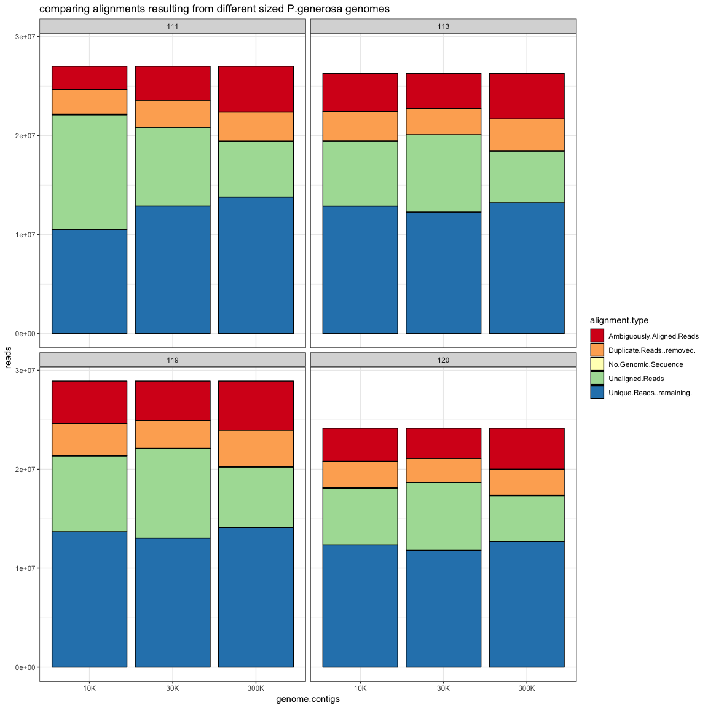
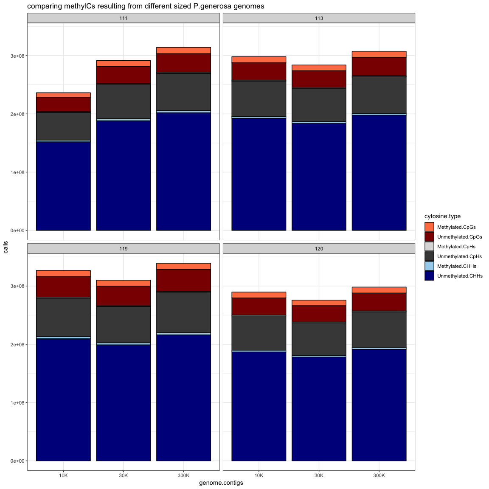

CompareGenomeVersions
================
Shelly Trigg
2/20/2019

load libraries

``` r
library(tidyr)
library(ggplot2)
```

read in data

``` r
tenK <- read.table("~/Documents/GitHub/Shelly_Pgenerosa/analyses/CompareGenomeVersions/20190214_10K/bismark_summary_report.txt", sep ="\t", header = TRUE)
thirtyK <- read.table("~/Documents/GitHub/Shelly_Pgenerosa/analyses/CompareGenomeVersions/20190214_30K/bismark_summary_report.txt", sep ="\t", header = TRUE)
threehundK <- read.table("/Volumes/web/metacarcinus/Pgenerosa/20181101/bismark_summary_report.txt", sep ="\t", header = TRUE)
```

create column for sample number and for genome size

``` r
tenK$sample <- substr(tenK$File,5,7)
tenK$genome.contigs <- "10K"
thirtyK$sample <- substr(thirtyK$File,5,7)
thirtyK$genome.contigs <- "30K"
threehundK$sample <- substr(threehundK$File,5,7)
threehundK$genome.contigs <- "300K"
```

merge data

``` r
all_data <- rbind(tenK, thirtyK, threehundK)
```

select only samples 111,113,119, and 120

``` r
all_data <- all_data[grep("111|113|119|120", all_data$sample),]
```

assign levels to order by genome size

``` r
all_data$genome.contigs <- factor(all_data$genome.contigs, levels = c("10K", "30K", "300K"))
```

subset only alignment, sample, and genome size data for comparing in stacked bar chart

``` r
all_data_alignments <- all_data[,c(4:8,16,17)]
```

reshape data so that alignment type is a column

``` r
all_data_alignments <- tidyr::gather(all_data_alignments, "alignment.type", "reads", 1:5)
```

make stacked bar plot

``` r
ggplot(all_data_alignments,aes(x = genome.contigs, y = reads)) + geom_bar(aes(fill = alignment.type), color = "black", stat = "identity") + facet_wrap(~sample) + theme_bw() + scale_fill_brewer(palette = "Spectral") + ggtitle("comparing alignments resulting from different sized P.generosa genomes")
```



subset only cytosine info, sample, and genome size data for comparing in stacked bar chart

``` r
all_data_cytosine <- all_data[,10:17]
```

reshape data so that cytosine type is a column

``` r
all_data_cytosine <- tidyr::gather(all_data_cytosine, "cytosine.type", "calls", 1:6)
```

assign levels to order by genome size

``` r
all_data_cytosine$cytosine.type <- factor(all_data_cytosine$cytosine.type, levels = c("Methylated.CpGs","Unmethylated.CpGs","Methylated.CpHs","Unmethylated.CpHs","Methylated.CHHs", "Unmethylated.CHHs"))
```

make stacked bar plot

``` r
ggplot(all_data_cytosine,aes(x = genome.contigs, y = calls)) + geom_bar(aes(fill = cytosine.type), color = "black", stat = "identity") + facet_wrap(~sample) + theme_bw() + scale_fill_manual(values = c("coral", "darkred", "gray86", "gray28", "lightskyblue2","darkblue")) + ggtitle("comparing methylCs resulting from different sized P.generosa genomes")
```


