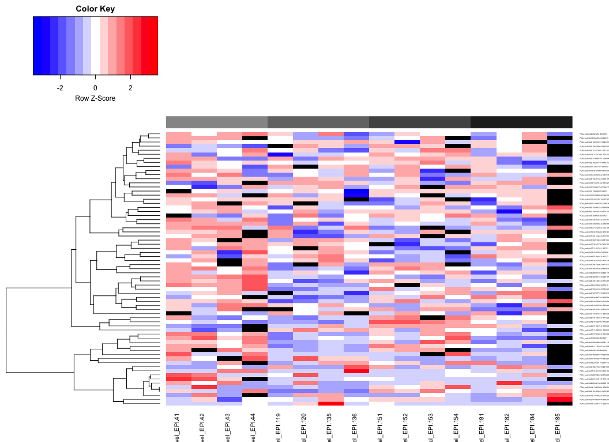
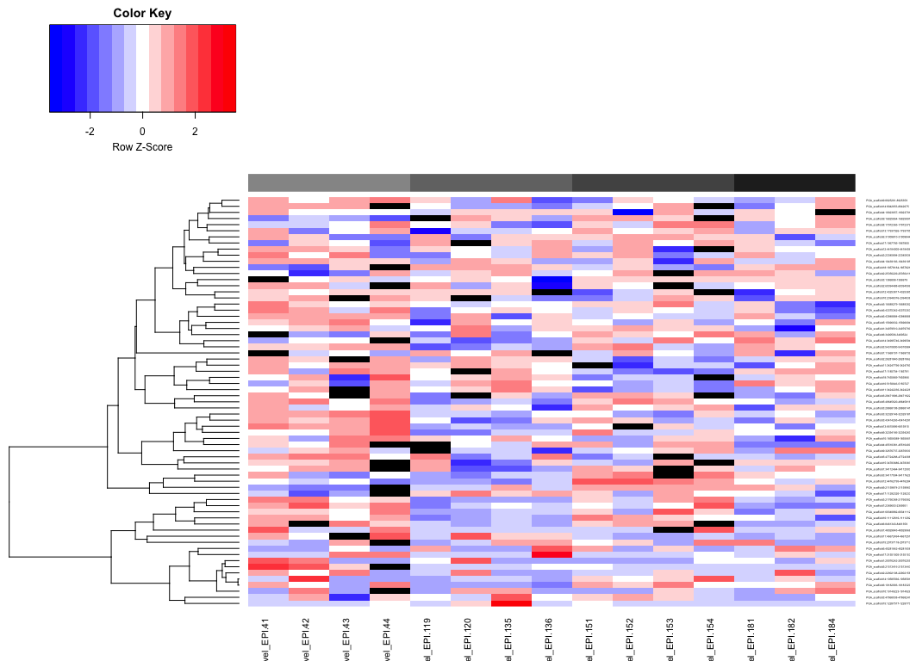
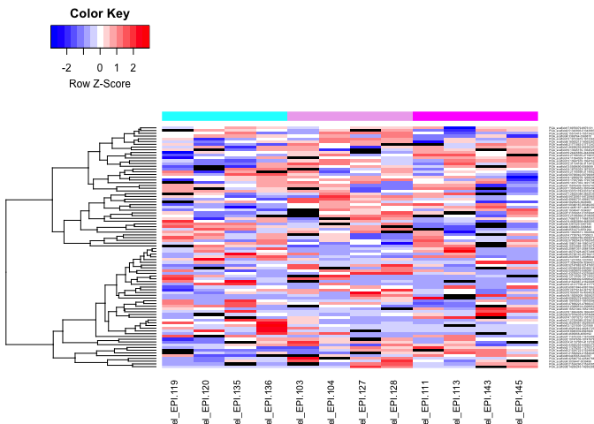
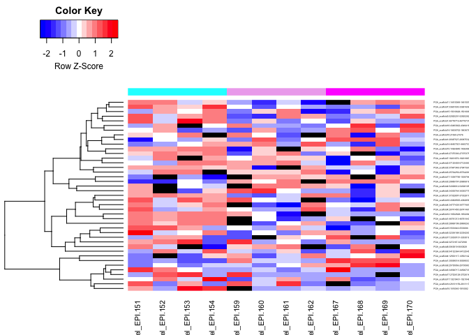
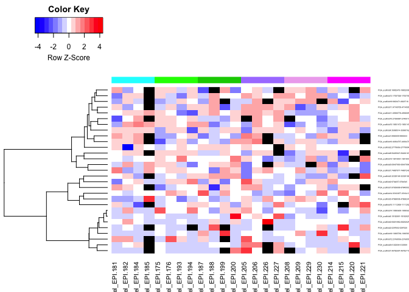

Oct24\_MCmax25DMR\_heatmaps
================
Shelly Trigg
10/24/2019

This script was run with Gannet mounted

load libraries

``` r
library(gplots)
```

    ## 
    ## Attaching package: 'gplots'

    ## The following object is masked from 'package:stats':
    ## 
    ##     lowess

read in data

``` r
oct24_MCmax25_DMRs_allAmb <- read.table("/Volumes/web/metacarcinus/Pgenerosa/analyses/20191024_25bp/amb_AllTimes_DMR250bp_MCmax25_cov5x_rms_results_filtered.tsv", header = TRUE, sep = "\t")
oct24_MCmax25_DMRs_day10 <- read.table("/Volumes/web/metacarcinus/Pgenerosa/analyses/20191024_25bp/day10_AllpH_DMR250bp_MCmax25_cov5x_rms_results_filtered.tsv", header = TRUE, sep = "\t")
oct24_MCmax25_DMRs_day135 <- read.table("/Volumes/web/metacarcinus/Pgenerosa/analyses/20191024_25bp/day135_AllpH_DMR250bp_MCmax25_cov5x_rms_results_filtered.tsv", header = TRUE, sep = "\t")
oct24_MCmax25_DMRs_day145 <- read.table("/Volumes/web/metacarcinus/Pgenerosa/analyses/20191024_25bp/day145_AllpH_DMR250bp_MCmax25_cov5x_rms_results_filtered.tsv", header = TRUE, sep = "\t")
```

Make a unique ID column in each data frame

``` r
#for all ambient sample comparison
oct24_MCmax25_DMRs_allAmb$ID <- paste(oct24_MCmax25_DMRs_allAmb$chr,":",oct24_MCmax25_DMRs_allAmb$start,"-",oct24_MCmax25_DMRs_allAmb$end, sep = "")
oct24_MCmax25_DMRs_allAmb$ID <- gsub("__.*__.*:",":",oct24_MCmax25_DMRs_allAmb$ID)

#for day 10 sample comparison

oct24_MCmax25_DMRs_day10$ID <- paste(oct24_MCmax25_DMRs_day10$chr,":",oct24_MCmax25_DMRs_day10$start,"-",oct24_MCmax25_DMRs_day10$end, sep = "")
oct24_MCmax25_DMRs_day10$ID <- gsub("__.*__.*:",":",oct24_MCmax25_DMRs_day10$ID)

#for day 135 sample comparison

oct24_MCmax25_DMRs_day135$ID <- paste(oct24_MCmax25_DMRs_day135$chr,":",oct24_MCmax25_DMRs_day135$start,"-",oct24_MCmax25_DMRs_day135$end, sep = "")
oct24_MCmax25_DMRs_day135$ID <- gsub("__.*__.*:",":",oct24_MCmax25_DMRs_day135$ID)

#for day 145 sample comparison

oct24_MCmax25_DMRs_day145$ID <- paste(oct24_MCmax25_DMRs_day145$chr,":",oct24_MCmax25_DMRs_day145$start,"-",oct24_MCmax25_DMRs_day145$end, sep = "")
oct24_MCmax25_DMRs_day145$ID <- gsub("__.*__.*:",":",oct24_MCmax25_DMRs_day145$ID)
```

create matrix for all ambient samples

``` r
allAmb_m <- as.matrix(oct24_MCmax25_DMRs_allAmb[,7:22])
rownames(allAmb_m) <- oct24_MCmax25_DMRs_allAmb$ID
```

plot heatmap of all ambient sample comparison

``` r
ColSideColors <- cbind(day = c(rep("#969696",4),rep("#737373",4),rep("#525252",4),rep("#252525",4)))
heatmap.2(allAmb_m,cexRow = 0.3, cexCol = 1,ColSideColors = ColSideColors, Colv=NA, col = bluered, na.color = "black", density.info = "none", trace = "none", scale = "row")
```

    ## Warning in heatmap.2(allAmb_m, cexRow = 0.3, cexCol = 1, ColSideColors =
    ## ColSideColors, : Discrepancy: Colv is FALSE, while dendrogram is `both'.
    ## Omitting column dendogram.



``` r
#try plotting without sample 185
ColSideColors <- cbind(day = c(rep("#969696",4),rep("#737373",4),rep("#525252",4),rep("#252525",3)))
heatmap.2(allAmb_m[,-16],cexRow = 0.3, cexCol = 1,ColSideColors = ColSideColors, Colv=NA, col = bluered, na.color = "black", density.info = "none", trace = "none", scale = "row")
```

    ## Warning in heatmap.2(allAmb_m[, -16], cexRow = 0.3, cexCol = 1,
    ## ColSideColors = ColSideColors, : Discrepancy: Colv is FALSE, while
    ## dendrogram is `both'. Omitting column dendogram.



create matrix for day10 samples

``` r
#subset out the data and order it
day10_m <- as.matrix(oct24_MCmax25_DMRs_day10[,c(11:14,7:8,15:16,9:10,17:18)])
rownames(day10_m) <- oct24_MCmax25_DMRs_day10$ID
```

plot heatmap of day10 sample comparison

``` r
ColSideColors <- cbind(pH = c(rep("cyan",4),rep("plum2",4),rep("magenta",4)))
heatmap.2(day10_m,cexRow = 0.3, cexCol = 1,ColSideColors = ColSideColors, Colv=NA, col = bluered, na.color = "black", density.info = "none", trace = "none", scale = "row")
```

    ## Warning in heatmap.2(day10_m, cexRow = 0.3, cexCol = 1, ColSideColors =
    ## ColSideColors, : Discrepancy: Colv is FALSE, while dendrogram is `both'.
    ## Omitting column dendogram.



create matrix for day135 samples

``` r
#subset out the data and order it
day135_m <- as.matrix(oct24_MCmax25_DMRs_day135[,c(7:18)])
rownames(day135_m) <- oct24_MCmax25_DMRs_day135$ID
```

plot heatmap of day135 sample comparison

``` r
ColSideColors <- cbind(pH = c(rep("cyan",4),rep("plum2",4),rep("magenta",4)))
heatmap.2(day135_m,cexRow = 0.3, cexCol = 1,ColSideColors = ColSideColors, Colv=NA, col = bluered, na.color = "black", density.info = "none", trace = "none", scale = "row")
```

    ## Warning in heatmap.2(day135_m, cexRow = 0.3, cexCol = 1, ColSideColors =
    ## ColSideColors, : Discrepancy: Colv is FALSE, while dendrogram is `both'.
    ## Omitting column dendogram.



create matrix for day145 samples

``` r
#subset out the data and order it
day145_m <- as.matrix(oct24_MCmax25_DMRs_day145[,c(9:12,7:8,15:16,13:14,17:18,19:20,27:28,21:22,29:30,23:26)])
rownames(day145_m) <- oct24_MCmax25_DMRs_day145$ID
```

plot heatmap of day145 sample comparison

``` r
ColSideColors <- cbind(pH = c(rep("cyan",4),rep("green1",4),rep("green3",4),rep("mediumpurple1",4),rep("plum2",4),rep("magenta",4)))
heatmap.2(day145_m,cexRow = 0.3, cexCol = 1,ColSideColors = ColSideColors, Colv=NA, col = bluered, na.color = "black", density.info = "none", trace = "none", scale = "row")
```

    ## Warning in heatmap.2(day145_m, cexRow = 0.3, cexCol = 1, ColSideColors =
    ## ColSideColors, : Discrepancy: Colv is FALSE, while dendrogram is `both'.
    ## Omitting column dendogram.


