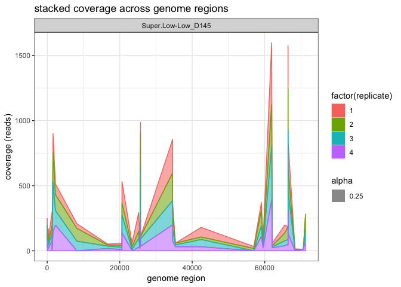
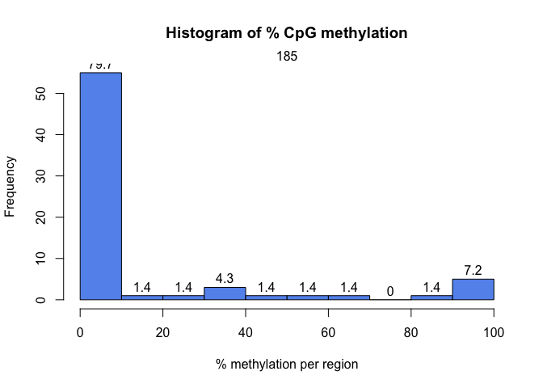
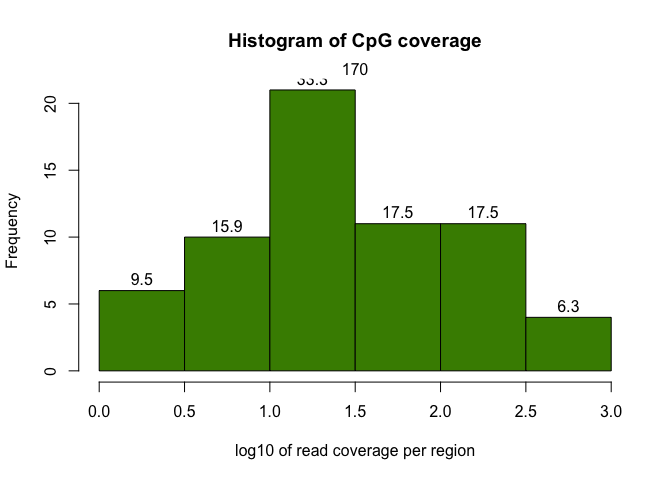
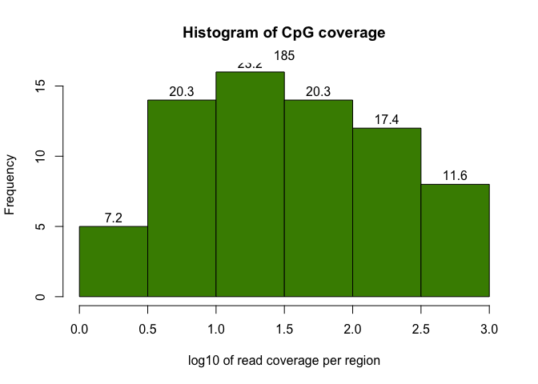

10Kreads\_Geoduck
================
Shelly Trigg
10/24/2018

Mapping Efficiency
------------------

``` r
mapEff <- data.frame(read.table("/Volumes/web/metacarcinus/Pgenerosa/20181011/EPI_mapping_dedup_summary_clean.txt", nrows = 52))
mapEff$V1 <- as.numeric(substr(as.character(unlist(mapEff$V1)),1,4))
colnames(mapEff)[1] <- "mapping_efficiency"
ggplot(mapEff, aes(mapping_efficiency)) + geom_histogram(color = "darkblue", fill = "lightblue") + xlab("mapping efficiency (%)") + ylab("number of samples")
```

    ## `stat_bin()` using `bins = 30`. Pick better value with `binwidth`.


### All samples have \> 50% mapping efficiency, which is pretty good.

            | sample no. | mapping efficiency (%) | duplicate reads | duplicated reads (%) |
            |------------|------------------------|-----------------|----------------------|
            | 103        | 65.9                   | 98              | 1.49                 |
            | 104        | 65.5                   | 81              | 1.24                 |
            | 111        | 64.4                   | 68              | 1.06                 |
            | 113        | 65.8                   | 131             | 2                    |
            | 119        | 64.0                   | 83              | 1.3                  |
            | 120        | 65.1                   | 73              | 1.13                 |
            | 127        | 65.8                   | 77              | 1.17                 |
            | 128        | 65.6                   | 89              | 1.36                 |
            | 135        | 63.3                   | 104             | 1.65                 |
            | 136        | 62.3                   | 97              | 1.56                 |
            | 143        | 63.1                   | 53              | 0.84                 |
            | 145        | 64.1                   | 93              | 1.45                 |
            | 151        | 60.2                   | 28              | 0.47                 |
            | 152        | 57.6                   | 41              | 0.72                 |
            | 153        | 61.3                   | 66              | 1.08                 |
            | 154        | 56.8                   | 33              | 0.59                 |
            | 159        | 62.4                   | 78              | 1.26                 |
            | 160        | 56.6                   | 80              | 1.42                 |
            | 161        | 52.9                   | 42              | 0.8                  |
            | 162        | 54.7                   | 55              | 1.01                 |
            | 167        | 63.5                   | 34              | 0.54                 |
            | 168        | 60.8                   | 58              | 0.96                 |
            | 169        | 59.1                   | 40              | 0.68                 |
            | 170        | 55.4                   | 69              | 1.25                 |
            | 175        | 62.5                   | 58              | 0.93                 |
            | 176        | 56.4                   | 59              | 1.05                 |
            | 181        | 60.9                   | 78              | 1.29                 |
            | 182        | 62.2                   | 110             | 1.78                 |
            | 184        | 61.7                   | 72              | 1.18                 |
            | 185        | 61.5                   | 73              | 1.2                  |
            | 187        | 64.0                   | 64              | 1.01                 |
            | 188        | 56.7                   | 53              | 0.94                 |
            | 193        | 57.6                   | 51              | 0.89                 |
            | 194        | 63.0                   | 34              | 0.54                 |
            | 199        | 58.4                   | 25              | 0.43                 |
            | 200        | 59.6                   | 38              | 0.64                 |
            | 205        | 55.6                   | 52              | 0.94                 |
            | 206        | 60.9                   | 33              | 0.54                 |
            | 208        | 56.6                   | 83              | 1.47                 |
            | 209        | 61.5                   | 47              | 0.77                 |
            | 214        | 58.6                   | 61              | 1.05                 |
            | 215        | 60.6                   | 43              | 0.71                 |
            | 220        | 62.1                   | 66              | 1.07                 |
            | 221        | 60.5                   | 38              | 0.63                 |
            | 226        | 63.5                   | 70              | 1.11                 |
            | 227        | 63.1                   | 38              | 0.6                  |
            | 229        | 61.2                   | 40              | 0.66                 |
            | 230        | 55.1                   | 46              | 0.84                 |
            | 41         | 59.2                   | 31              | 0.53                 |
            | 42         | 61.8                   | 22              | 0.36                 |
            | 43         | 62.1                   | 15              | 0.24                 |
            | 44         | 61.6                   | 17              | 0.28                 |

Assessing coverage and percent methylation with methylkit
---------------------------------------------------------

Create file list for reading in Bismark alignments (deduplicated sorted bam files)

``` r
file.list=c(dir("/Volumes/web/metacarcinus/Pgenerosa/20181011/dedup_sorted_bams/",pattern = "_dedup.sorted.bam"))
file.list <- paste("/Volumes/web/metacarcinus/Pgenerosa/20181011/dedup_sorted_bams/", file.list, sep = "")
file.list <- as.list(file.list)
```

Read in treatment info for these samples

``` r
treatment <- read.csv("~/Documents/GitHub/Shelly_Pgenerosa/data/Treatment_info.csv", header = TRUE)
#subset dataframe to exclude lines with no info in them
treatment <- treatment[1:52,]

#create a list of lists (the format that methylkit expects) for sample ids
li <- list()
for (i in 1:length(treatment$sampleno))
  li[[i]] = as.character(treatment$sampleno[i])

#order treatment data frame by treatment to be able to add replicate numbers to each sample
treatment <- treatment[order(treatment$treatment),]
#create replicate numbers (1-4) for each treatment (13)
treatment$replicate <- rep(1:4,13)
```

Read methylation calls from Bismark alignments

``` r
myobj <- processBismarkAln(location = file.list, sample.id = li, 
                          assembly = "v3", read.context="CpG", mincov=3, treatment = treatment$treatment)
```

    ## Conversion Statistics:
    ## 
    ## total otherC considered (>95% C+T): 1954
    ## average conversion rate = 99.115675504804
    ## total otherC considered (Forward) (>95% C+T): 752
    ## average conversion rate (Forward) = 99.113235019658
    ## total otherC considered (Reverse) (>95% C+T): 1202
    ## average conversion rate (Reverse) = 99.117202330786
    ## 
    ## Reading methylation percentage per base for sample: 103 
    ## 
    ## Conversion Statistics:
    ## 
    ## total otherC considered (>95% C+T): 1703
    ## average conversion rate = 99.091566662237
    ## total otherC considered (Forward) (>95% C+T): 763
    ## average conversion rate (Forward) = 98.99472328806
    ## total otherC considered (Reverse) (>95% C+T): 940
    ## average conversion rate (Reverse) = 99.170174635106
    ## 
    ## Reading methylation percentage per base for sample: 104 
    ## 
    ## Conversion Statistics:
    ## 
    ## total otherC considered (>95% C+T): 1595
    ## average conversion rate = 99.086660032761
    ## total otherC considered (Forward) (>95% C+T): 687
    ## average conversion rate (Forward) = 99.200731735507
    ## total otherC considered (Reverse) (>95% C+T): 908
    ## average conversion rate (Reverse) = 99.00035247793
    ## 
    ## Reading methylation percentage per base for sample: 111 
    ## 
    ## Conversion Statistics:
    ## 
    ## total otherC considered (>95% C+T): 2267
    ## average conversion rate = 98.850434859364
    ## total otherC considered (Forward) (>95% C+T): 972
    ## average conversion rate (Forward) = 98.841197814332
    ## total otherC considered (Reverse) (>95% C+T): 1295
    ## average conversion rate (Reverse) = 98.857367992778
    ## 
    ## Reading methylation percentage per base for sample: 113 
    ## 
    ## Conversion Statistics:
    ## 
    ## total otherC considered (>95% C+T): 2914
    ## average conversion rate = 98.978387844372
    ## total otherC considered (Forward) (>95% C+T): 1285
    ## average conversion rate (Forward) = 98.841458105731
    ## total otherC considered (Reverse) (>95% C+T): 1629
    ## average conversion rate (Reverse) = 99.08640178799
    ## 
    ## Reading methylation percentage per base for sample: 119 
    ## 
    ## Conversion Statistics:
    ## 
    ## total otherC considered (>95% C+T): 1718
    ## average conversion rate = 98.020708359873
    ## total otherC considered (Forward) (>95% C+T): 848
    ## average conversion rate (Forward) = 98.980440923466
    ## total otherC considered (Reverse) (>95% C+T): 870
    ## average conversion rate (Reverse) = 97.08524489559
    ## 
    ## Reading methylation percentage per base for sample: 120 
    ## 
    ## Conversion Statistics:
    ## 
    ## total otherC considered (>95% C+T): 1983
    ## average conversion rate = 98.126261541491
    ## total otherC considered (Forward) (>95% C+T): 826
    ## average conversion rate (Forward) = 98.019043980188
    ## total otherC considered (Reverse) (>95% C+T): 1157
    ## average conversion rate (Reverse) = 98.202805798739
    ## 
    ## Reading methylation percentage per base for sample: 127 
    ## 
    ## Conversion Statistics:
    ## 
    ## total otherC considered (>95% C+T): 2055
    ## average conversion rate = 98.502804893619
    ## total otherC considered (Forward) (>95% C+T): 961
    ## average conversion rate (Forward) = 98.036645247115
    ## total otherC considered (Reverse) (>95% C+T): 1094
    ## average conversion rate (Reverse) = 98.912292480722
    ## 
    ## Reading methylation percentage per base for sample: 128 
    ## 
    ## Conversion Statistics:
    ## 
    ## total otherC considered (>95% C+T): 2032
    ## average conversion rate = 98.02613412332
    ## total otherC considered (Forward) (>95% C+T): 966
    ## average conversion rate (Forward) = 98.900538659227
    ## total otherC considered (Reverse) (>95% C+T): 1066
    ## average conversion rate (Reverse) = 97.233756279337
    ## 
    ## Reading methylation percentage per base for sample: 135 
    ## 
    ## Conversion Statistics:
    ## 
    ## total otherC considered (>95% C+T): 2158
    ## average conversion rate = 98.725726636734
    ## total otherC considered (Forward) (>95% C+T): 1008
    ## average conversion rate (Forward) = 99.164488603183
    ## total otherC considered (Reverse) (>95% C+T): 1150
    ## average conversion rate (Reverse) = 98.341142234838
    ## 
    ## Reading methylation percentage per base for sample: 136 
    ## 
    ## Conversion Statistics:
    ## 
    ## total otherC considered (>95% C+T): 1506
    ## average conversion rate = 98.598065160132
    ## total otherC considered (Forward) (>95% C+T): 667
    ## average conversion rate (Forward) = 99.219811772782
    ## total otherC considered (Reverse) (>95% C+T): 839
    ## average conversion rate (Reverse) = 98.10378030836
    ## 
    ## Reading methylation percentage per base for sample: 143 
    ## 
    ## Conversion Statistics:
    ## 
    ## total otherC considered (>95% C+T): 2238
    ## average conversion rate = 97.567936602561
    ## total otherC considered (Forward) (>95% C+T): 1113
    ## average conversion rate (Forward) = 96.551351158002
    ## total otherC considered (Reverse) (>95% C+T): 1125
    ## average conversion rate (Reverse) = 98.573678469045
    ## 
    ## Reading methylation percentage per base for sample: 145 
    ## 
    ## Conversion Statistics:
    ## 
    ## total otherC considered (>95% C+T): 2406
    ## average conversion rate = 96.836212382661
    ## total otherC considered (Forward) (>95% C+T): 984
    ## average conversion rate (Forward) = 98.584338167471
    ## total otherC considered (Reverse) (>95% C+T): 1422
    ## average conversion rate (Reverse) = 95.626538843805
    ## 
    ## Reading methylation percentage per base for sample: 151 
    ## 
    ## Conversion Statistics:
    ## 
    ## total otherC considered (>95% C+T): 1905
    ## average conversion rate = 98.065491486328
    ## total otherC considered (Forward) (>95% C+T): 837
    ## average conversion rate (Forward) = 97.00575823777
    ## total otherC considered (Reverse) (>95% C+T): 1068
    ## average conversion rate (Reverse) = 98.896012768204
    ## 
    ## Reading methylation percentage per base for sample: 152 
    ## 
    ## Conversion Statistics:
    ## 
    ## total otherC considered (>95% C+T): 2355
    ## average conversion rate = 98.554719980527
    ## total otherC considered (Forward) (>95% C+T): 835
    ## average conversion rate (Forward) = 98.555072329074
    ## total otherC considered (Reverse) (>95% C+T): 1520
    ## average conversion rate (Reverse) = 98.554526420634
    ## 
    ## Reading methylation percentage per base for sample: 153 
    ## 
    ## Conversion Statistics:
    ## 
    ## total otherC considered (>95% C+T): 1733
    ## average conversion rate = 98.872217074589
    ## total otherC considered (Forward) (>95% C+T): 756
    ## average conversion rate (Forward) = 98.633383971892
    ## total otherC considered (Reverse) (>95% C+T): 977
    ## average conversion rate (Reverse) = 99.057025493871
    ## 
    ## Reading methylation percentage per base for sample: 154 
    ## 
    ## Conversion Statistics:
    ## 
    ## total otherC considered (>95% C+T): 2020
    ## average conversion rate = 98.269743664748
    ## total otherC considered (Forward) (>95% C+T): 824
    ## average conversion rate (Forward) = 99.088496247838
    ## total otherC considered (Reverse) (>95% C+T): 1196
    ## average conversion rate (Reverse) = 97.705653256332
    ## 
    ## Reading methylation percentage per base for sample: 159 
    ## 
    ## Conversion Statistics:
    ## 
    ## total otherC considered (>95% C+T): 2204
    ## average conversion rate = 98.045374731075
    ## total otherC considered (Forward) (>95% C+T): 950
    ## average conversion rate (Forward) = 98.442836003677
    ## total otherC considered (Reverse) (>95% C+T): 1254
    ## average conversion rate (Reverse) = 97.744267706377
    ## 
    ## Reading methylation percentage per base for sample: 160 
    ## 
    ## Conversion Statistics:
    ## 
    ## total otherC considered (>95% C+T): 1994
    ## average conversion rate = 98.815982874117
    ## total otherC considered (Forward) (>95% C+T): 892
    ## average conversion rate (Forward) = 99.045457432259
    ## total otherC considered (Reverse) (>95% C+T): 1102
    ## average conversion rate (Reverse) = 98.63023758749
    ## 
    ## Reading methylation percentage per base for sample: 161 
    ## 
    ## Conversion Statistics:
    ## 
    ## total otherC considered (>95% C+T): 1856
    ## average conversion rate = 94.625681320783
    ## total otherC considered (Forward) (>95% C+T): 815
    ## average conversion rate (Forward) = 93.347255899684
    ## total otherC considered (Reverse) (>95% C+T): 1041
    ## average conversion rate (Reverse) = 95.626561933844
    ## 
    ## Reading methylation percentage per base for sample: 162 
    ## 
    ## Conversion Statistics:
    ## 
    ## total otherC considered (>95% C+T): 2174
    ## average conversion rate = 95.866101137019
    ## total otherC considered (Forward) (>95% C+T): 994
    ## average conversion rate (Forward) = 96.915505874158
    ## total otherC considered (Reverse) (>95% C+T): 1180
    ## average conversion rate (Reverse) = 94.982111044887
    ## 
    ## Reading methylation percentage per base for sample: 167 
    ## 
    ## Conversion Statistics:
    ## 
    ## total otherC considered (>95% C+T): 2546
    ## average conversion rate = 97.301169465597
    ## total otherC considered (Forward) (>95% C+T): 1160
    ## average conversion rate (Forward) = 95.574572402796
    ## total otherC considered (Reverse) (>95% C+T): 1386
    ## average conversion rate (Reverse) = 98.746229056397
    ## 
    ## Reading methylation percentage per base for sample: 168 
    ## 
    ## Conversion Statistics:
    ## 
    ## total otherC considered (>95% C+T): 2170
    ## average conversion rate = 98.672235327817
    ## total otherC considered (Forward) (>95% C+T): 922
    ## average conversion rate (Forward) = 98.506674784049
    ## total otherC considered (Reverse) (>95% C+T): 1248
    ## average conversion rate (Reverse) = 98.794548485954
    ## 
    ## Reading methylation percentage per base for sample: 169 
    ## 
    ## Conversion Statistics:
    ## 
    ## total otherC considered (>95% C+T): 2448
    ## average conversion rate = 98.557103975994
    ## total otherC considered (Forward) (>95% C+T): 1042
    ## average conversion rate (Forward) = 98.464589796715
    ## total otherC considered (Reverse) (>95% C+T): 1406
    ## average conversion rate (Reverse) = 98.625667115972
    ## 
    ## Reading methylation percentage per base for sample: 170 
    ## 
    ## Conversion Statistics:
    ## 
    ## total otherC considered (>95% C+T): 2114
    ## average conversion rate = 98.278143901507
    ## total otherC considered (Forward) (>95% C+T): 869
    ## average conversion rate (Forward) = 97.736472459386
    ## total otherC considered (Reverse) (>95% C+T): 1245
    ## average conversion rate (Reverse) = 98.656226217332
    ## 
    ## Reading methylation percentage per base for sample: 175 
    ## 
    ## Conversion Statistics:
    ## 
    ## total otherC considered (>95% C+T): 2421
    ## average conversion rate = 98.487245916148
    ## total otherC considered (Forward) (>95% C+T): 1023
    ## average conversion rate (Forward) = 98.957631397892
    ## total otherC considered (Reverse) (>95% C+T): 1398
    ## average conversion rate (Reverse) = 98.143036797533
    ## 
    ## Reading methylation percentage per base for sample: 176 
    ## 
    ## Conversion Statistics:
    ## 
    ## total otherC considered (>95% C+T): 2947
    ## average conversion rate = 96.304897656732
    ## total otherC considered (Forward) (>95% C+T): 1293
    ## average conversion rate (Forward) = 96.255046634379
    ## total otherC considered (Reverse) (>95% C+T): 1654
    ## average conversion rate (Reverse) = 96.343868256431
    ## 
    ## Reading methylation percentage per base for sample: 181 
    ## 
    ## Conversion Statistics:
    ## 
    ## total otherC considered (>95% C+T): 2290
    ## average conversion rate = 97.485583674046
    ## total otherC considered (Forward) (>95% C+T): 1007
    ## average conversion rate (Forward) = 98.838449523138
    ## total otherC considered (Reverse) (>95% C+T): 1283
    ## average conversion rate (Reverse) = 96.423747423043
    ## 
    ## Reading methylation percentage per base for sample: 182 
    ## 
    ## Conversion Statistics:
    ## 
    ## total otherC considered (>95% C+T): 2183
    ## average conversion rate = 96.82593058379
    ## total otherC considered (Forward) (>95% C+T): 997
    ## average conversion rate (Forward) = 95.693775147159
    ## total otherC considered (Reverse) (>95% C+T): 1186
    ## average conversion rate (Reverse) = 97.777666646456
    ## 
    ## Reading methylation percentage per base for sample: 184 
    ## 
    ## Conversion Statistics:
    ## 
    ## total otherC considered (>95% C+T): 3174
    ## average conversion rate = 93.266977189024
    ## total otherC considered (Forward) (>95% C+T): 1343
    ## average conversion rate (Forward) = 98.531398150215
    ## total otherC considered (Reverse) (>95% C+T): 1831
    ## average conversion rate (Reverse) = 89.405635107714
    ## 
    ## Reading methylation percentage per base for sample: 185 
    ## 
    ## Conversion Statistics:
    ## 
    ## total otherC considered (>95% C+T): 2770
    ## average conversion rate = 95.302060697731
    ## total otherC considered (Forward) (>95% C+T): 1226
    ## average conversion rate (Forward) = 96.716880050415
    ## total otherC considered (Reverse) (>95% C+T): 1544
    ## average conversion rate (Reverse) = 94.178635486338
    ## 
    ## Reading methylation percentage per base for sample: 187 
    ## 
    ## Conversion Statistics:
    ## 
    ## total otherC considered (>95% C+T): 2132
    ## average conversion rate = 98.559533232719
    ## total otherC considered (Forward) (>95% C+T): 910
    ## average conversion rate (Forward) = 98.415417485601
    ## total otherC considered (Reverse) (>95% C+T): 1222
    ## average conversion rate (Reverse) = 98.666853469935
    ## 
    ## Reading methylation percentage per base for sample: 188 
    ## 
    ## Conversion Statistics:
    ## 
    ## total otherC considered (>95% C+T): 1746
    ## average conversion rate = 98.835485936265
    ## total otherC considered (Forward) (>95% C+T): 755
    ## average conversion rate (Forward) = 98.67585416726
    ## total otherC considered (Reverse) (>95% C+T): 991
    ## average conversion rate (Reverse) = 98.957102470673
    ## 
    ## Reading methylation percentage per base for sample: 193 
    ## 
    ## Conversion Statistics:
    ## 
    ## total otherC considered (>95% C+T): 2158
    ## average conversion rate = 94.605942688871
    ## total otherC considered (Forward) (>95% C+T): 907
    ## average conversion rate (Forward) = 98.287279643887
    ## total otherC considered (Reverse) (>95% C+T): 1251
    ## average conversion rate (Reverse) = 91.9368998286
    ## 
    ## Reading methylation percentage per base for sample: 194 
    ## 
    ## Conversion Statistics:
    ## 
    ## total otherC considered (>95% C+T): 1951
    ## average conversion rate = 94.967529660038
    ## total otherC considered (Forward) (>95% C+T): 768
    ## average conversion rate (Forward) = 94.754508429213
    ## total otherC considered (Reverse) (>95% C+T): 1183
    ## average conversion rate (Reverse) = 95.105822394843
    ## 
    ## Reading methylation percentage per base for sample: 199 
    ## 
    ## Conversion Statistics:
    ## 
    ## total otherC considered (>95% C+T): 1501
    ## average conversion rate = 97.765649072761
    ## total otherC considered (Forward) (>95% C+T): 715
    ## average conversion rate (Forward) = 97.710956535398
    ## total otherC considered (Reverse) (>95% C+T): 786
    ## average conversion rate (Reverse) = 97.815401190083
    ## 
    ## Reading methylation percentage per base for sample: 200 
    ## 
    ## Conversion Statistics:
    ## 
    ## total otherC considered (>95% C+T): 1914
    ## average conversion rate = 96.815235366206
    ## total otherC considered (Forward) (>95% C+T): 715
    ## average conversion rate (Forward) = 95.359398142408
    ## total otherC considered (Reverse) (>95% C+T): 1199
    ## average conversion rate (Reverse) = 97.683395178563
    ## 
    ## Reading methylation percentage per base for sample: 205 
    ## 
    ## Conversion Statistics:
    ## 
    ## total otherC considered (>95% C+T): 2816
    ## average conversion rate = 97.932354438698
    ## total otherC considered (Forward) (>95% C+T): 1181
    ## average conversion rate (Forward) = 99.012537835168
    ## total otherC considered (Reverse) (>95% C+T): 1635
    ## average conversion rate (Reverse) = 97.152111875254
    ## 
    ## Reading methylation percentage per base for sample: 206 
    ## 
    ## Conversion Statistics:
    ## 
    ## total otherC considered (>95% C+T): 1728
    ## average conversion rate = 98.657308187001
    ## total otherC considered (Forward) (>95% C+T): 841
    ## average conversion rate (Forward) = 98.053308039528
    ## total otherC considered (Reverse) (>95% C+T): 887
    ## average conversion rate (Reverse) = 99.229984764256
    ## 
    ## Reading methylation percentage per base for sample: 208 
    ## 
    ## Conversion Statistics:
    ## 
    ## total otherC considered (>95% C+T): 2644
    ## average conversion rate = 98.608436378432
    ## total otherC considered (Forward) (>95% C+T): 1243
    ## average conversion rate (Forward) = 98.825228681932
    ## total otherC considered (Reverse) (>95% C+T): 1401
    ## average conversion rate (Reverse) = 98.416093171258
    ## 
    ## Reading methylation percentage per base for sample: 209 
    ## 
    ## Conversion Statistics:
    ## 
    ## total otherC considered (>95% C+T): 2018
    ## average conversion rate = 96.73525374762
    ## total otherC considered (Forward) (>95% C+T): 836
    ## average conversion rate (Forward) = 98.818270543169
    ## total otherC considered (Reverse) (>95% C+T): 1182
    ## average conversion rate (Reverse) = 95.26198636938
    ## 
    ## Reading methylation percentage per base for sample: 214 
    ## 
    ## Conversion Statistics:
    ## 
    ## total otherC considered (>95% C+T): 2092
    ## average conversion rate = 98.69135786153
    ## total otherC considered (Forward) (>95% C+T): 948
    ## average conversion rate (Forward) = 98.787396329275
    ## total otherC considered (Reverse) (>95% C+T): 1144
    ## average conversion rate (Reverse) = 98.611773536861
    ## 
    ## Reading methylation percentage per base for sample: 215 
    ## 
    ## Conversion Statistics:
    ## 
    ## total otherC considered (>95% C+T): 2496
    ## average conversion rate = 95.565299518454
    ## total otherC considered (Forward) (>95% C+T): 1127
    ## average conversion rate (Forward) = 96.169218530431
    ## total otherC considered (Reverse) (>95% C+T): 1369
    ## average conversion rate (Reverse) = 95.068136095154
    ## 
    ## Reading methylation percentage per base for sample: 220 
    ## 
    ## Conversion Statistics:
    ## 
    ## total otherC considered (>95% C+T): 1940
    ## average conversion rate = 95.433194504479
    ## total otherC considered (Forward) (>95% C+T): 804
    ## average conversion rate (Forward) = 93.748299254092
    ## total otherC considered (Reverse) (>95% C+T): 1136
    ## average conversion rate (Reverse) = 96.62567318521
    ## 
    ## Reading methylation percentage per base for sample: 221 
    ## 
    ## Conversion Statistics:
    ## 
    ## total otherC considered (>95% C+T): 2608
    ## average conversion rate = 93.728350745146
    ## total otherC considered (Forward) (>95% C+T): 1012
    ## average conversion rate (Forward) = 96.01891376117
    ## total otherC considered (Reverse) (>95% C+T): 1596
    ## average conversion rate (Reverse) = 92.275938607166
    ## 
    ## Reading methylation percentage per base for sample: 226 
    ## 
    ## Conversion Statistics:
    ## 
    ## total otherC considered (>95% C+T): 2085
    ## average conversion rate = 95.675277667106
    ## total otherC considered (Forward) (>95% C+T): 1016
    ## average conversion rate (Forward) = 98.600927782684
    ## total otherC considered (Reverse) (>95% C+T): 1069
    ## average conversion rate (Reverse) = 92.894678492712
    ## 
    ## Reading methylation percentage per base for sample: 227 
    ## 
    ## Conversion Statistics:
    ## 
    ## total otherC considered (>95% C+T): 2704
    ## average conversion rate = 98.683195902874
    ## total otherC considered (Forward) (>95% C+T): 1149
    ## average conversion rate (Forward) = 98.616017473235
    ## total otherC considered (Reverse) (>95% C+T): 1555
    ## average conversion rate (Reverse) = 98.732834498151
    ## 
    ## Reading methylation percentage per base for sample: 229 
    ## 
    ## Conversion Statistics:
    ## 
    ## total otherC considered (>95% C+T): 1969
    ## average conversion rate = 98.439037932237
    ## total otherC considered (Forward) (>95% C+T): 940
    ## average conversion rate (Forward) = 98.56021329913
    ## total otherC considered (Reverse) (>95% C+T): 1029
    ## average conversion rate (Reverse) = 98.328343233617
    ## 
    ## Reading methylation percentage per base for sample: 230 
    ## 
    ## Conversion Statistics:
    ## 
    ## total otherC considered (>95% C+T): 1562
    ## average conversion rate = 97.586185203713
    ## total otherC considered (Forward) (>95% C+T): 706
    ## average conversion rate (Forward) = 98.463026224959
    ## total otherC considered (Reverse) (>95% C+T): 856
    ## average conversion rate (Reverse) = 96.862996230583
    ## 
    ## Reading methylation percentage per base for sample: 41 
    ## 
    ## Conversion Statistics:
    ## 
    ## total otherC considered (>95% C+T): 1366
    ## average conversion rate = 95.234970693346
    ## total otherC considered (Forward) (>95% C+T): 656
    ## average conversion rate (Forward) = 95.542574551862
    ## total otherC considered (Reverse) (>95% C+T): 710
    ## average conversion rate (Reverse) = 94.950762057872
    ## 
    ## Reading methylation percentage per base for sample: 42 
    ## 
    ## Conversion Statistics:
    ## 
    ## total otherC considered (>95% C+T): 1606
    ## average conversion rate = 88.82252879908
    ## total otherC considered (Forward) (>95% C+T): 625
    ## average conversion rate (Forward) = 95.260778704525
    ## total otherC considered (Reverse) (>95% C+T): 981
    ## average conversion rate (Reverse) = 84.720687625886
    ## 
    ## Reading methylation percentage per base for sample: 43 
    ## 
    ## Conversion Statistics:
    ## 
    ## total otherC considered (>95% C+T): 1169
    ## average conversion rate = 92.933788243882
    ## total otherC considered (Forward) (>95% C+T): 515
    ## average conversion rate (Forward) = 98.640909791395
    ## total otherC considered (Reverse) (>95% C+T): 654
    ## average conversion rate (Reverse) = 88.439648187355
    ## 
    ## Reading methylation percentage per base for sample: 44

calculate region coverage

``` r
tiles <- tileMethylCounts(myobj,win.size=1000,step.size=1000)
```

find regions covered by all samples (This finds regions that are covered by two or more samples I believe, because the covereage has NAs for some samples.)

``` r
mmeth <- unite(tiles, min.per.group = 1L)
```

``` r
#chromosome regions covered by at least two samples
nrow(getData(mmeth))
```

    ## [1] 39

``` r
#chromosome regions that are covered by all samples
d_noNAs <-getData(mmeth)[complete.cases(getData(mmeth)),]
nrow(d_noNAs)
```

    ## [1] 11

### There are only 11 regions that have coverage from all samples

Make a data frame with unqiue chromosome positions, sample number, and coverage to plots coverage for each sample

``` r
#subset mmeth data for genome locations and sample coverage of each location
d <- getData(mmeth)[,c(1:2,grep("coverage", colnames(getData(mmeth))))]
#make genome region names easier to read; remove all characters downstream '__'
d$chr <- sub("__.*","",d$chr)
#remove 'PGA_scaffold' from genome region names, leaving only the scaffold number
d$chr <- sub("PGA_scaffold","",d$chr)
#add position info to the genome region names and convert to numeric for continuous plotting 
d$chr <- as.numeric(paste(d$chr,d$start, sep ="."))
#load tidyr library to reshape data for plotting; can't load this in the beginning because it interfers with methylkit
library(tidyr)
```

    ## Warning: package 'tidyr' was built under R version 3.4.4

    ## 
    ## Attaching package: 'tidyr'

    ## The following object is masked from 'package:methylKit':
    ## 
    ##     unite

    ## The following object is masked from 'package:S4Vectors':
    ## 
    ##     expand

``` r
#reshape data from wide to long for plotting
d <- gather(d, order, coverage, 3:ncol(d))
#remove 'coverage' from order column so only numbers remain
d$order <- sub("coverage","",d$order)
#merge treatment info with coverage data for plotting
d <- merge(d, treatment[,5:9])
#replace NAs with zeros
d[is.na(d)] <- 0
```



    ## `stat_bin()` using `bins = 30`. Pick better value with `binwidth`.

 plot % methylation per region facetted by treatment and sample

``` r
#make data frame with all meth info (source code: https://github.com/al2na/methylKit/blob/master/R/methylDBFunctions.R)
all_tiles <- data.frame()
for (i in 1:length(tiles)){
  temp <- getData(tiles[[i]])[,c(1,2,5,6)]
  temp$chr <- sub("__.*","",temp$chr)
  temp$chr <- sub("PGA_scaffold","",temp$chr)
  temp$chr <- paste(temp$chr,temp$start, sep =".")
  temp$order <- i
  temp$percentMeth <- 100*temp$numCs/temp$coverage
  all_tiles <- rbind(all_tiles, temp)
}
all_tiles <- merge(all_tiles, treatment, by = "order")
```


individual plots of % methylation per region



individual plots of read coverage per region


